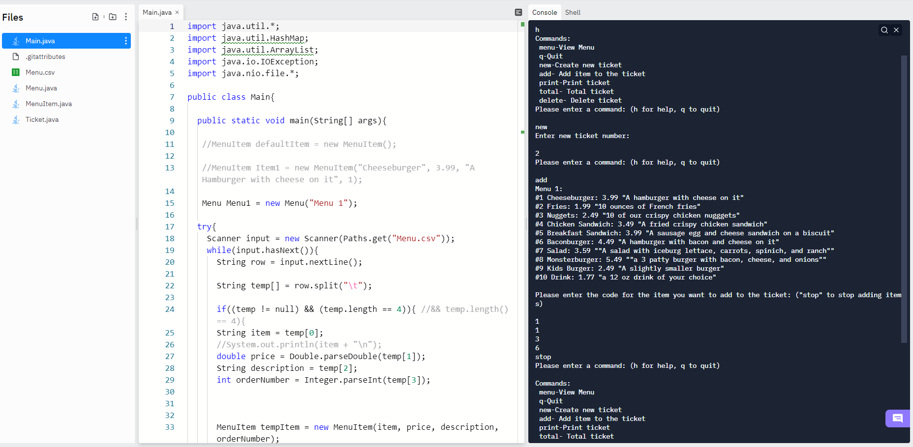
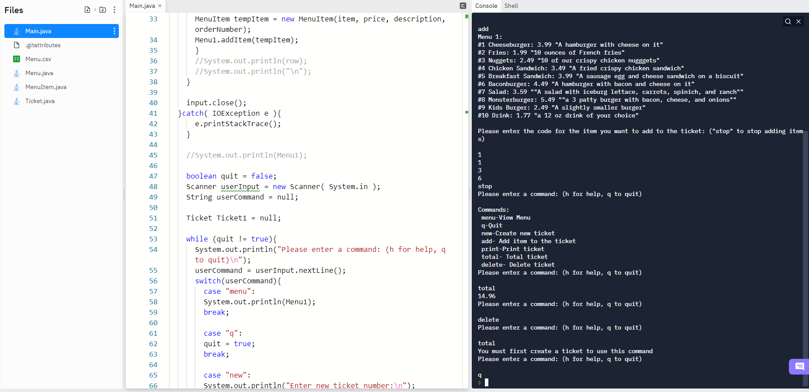

# Java 5- Menu
 
## A menu ticket creator controlled with console input.

#### Short Description
This program is a console-based application used to create and calculate the price a *ticket* in a restaurant environment. The program takes input from a .csv file to construct a *menu* that will be used to create a ticket. A user creates a ticket by inputting commands to the console. For example, *new* constructs a ticket, and *add* prompts the user to enter the numeric designator (*int orderCode*) of the item(s) they want to add to the ticket. This program uses three different classes: *Menu, MenuItem, and Ticket*. The *Menu* is a static ArrayList of *MenuItems* constructed on program launch. A *Ticket* is a dynamic ArrayList of MenuItems that can be altered by the user.

#### MenuItem Class
```
public class MenuItem{

    private String name;
    private double price;
    private String description;
    private int orderCode;

```
#### Full Description
The program starts by constructing the *Menu* which will be used as the basis for the rest of the program. The menu is constructed using the input from the **Menu.csv** file. Each line is read in and stored as a new *MenuItem* in the *Menu* arraylist. The program then enters a while loop that propts the user for input. The user can now enter one of many possible commands to the console, which can be used to create or effect a ticket. The *menu* command prints the contents of the menu to the console. The *q* command exits the loop, terminating the user input and closing the program. The *new* command constructs a *ticket*, which stores an ArrayList of *MenuItems*. The user is prompted to input the *ticket number* before the ticket is constructed. The *add* command prompts the user to enter the *orderCode* of the item(s) they want to add to the *ticket*. The user must input *stop* to stop adding items. The *print* command prints the contents of the current *ticket* to the screen. The *total* command calculates and prints to the console the total price of the current ticket. The *delete* command deletes the current ticket. Generally, the user in meant to enter *new* to create a new ticket, *add* selected items to the ticket, *total* to get the cost of the ticket, and *delete* the ticket when they are done. 

#### Screenshots of the code running



